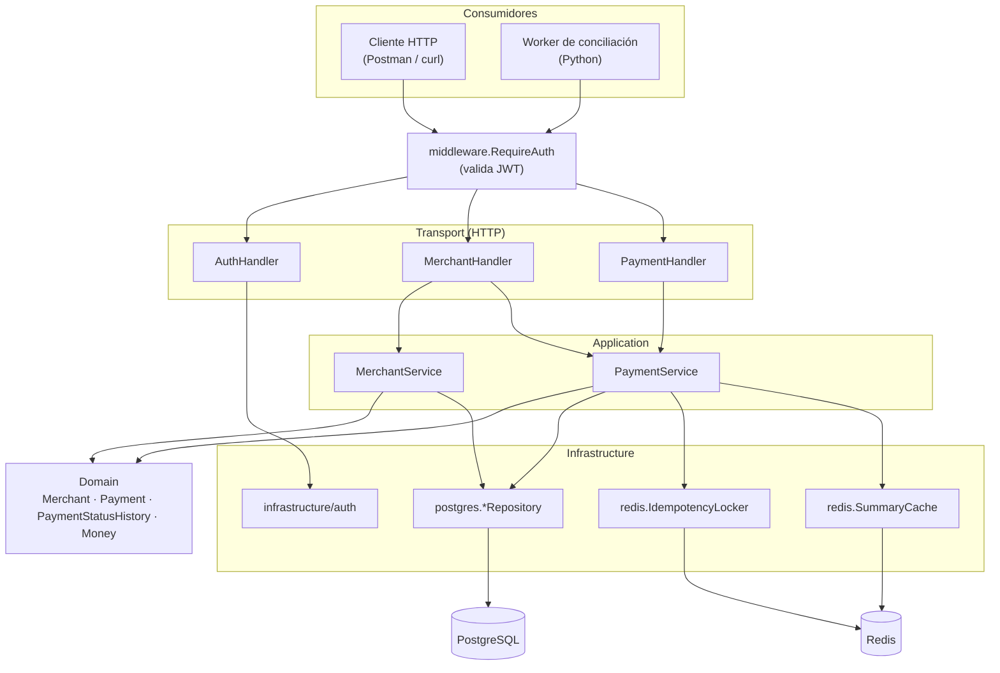
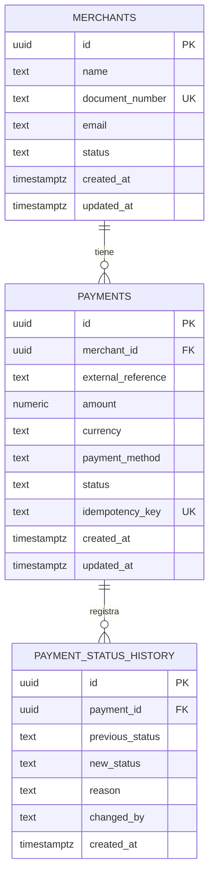

# MOVA · API de procesamiento de pagos (Go + Python)

Prueba técnica Backend — pista Go + Python. API de pagos desarrollada en Go más un proceso de conciliación en Python que
consume dicha API.

## Descripción

Servicio backend que permite a comercios registrar pagos, consultarlos,
actualizar su estado con trazabilidad completa, y obtener un resumen de
movimientos. Garantiza idempotencia en la creación de pagos y evita
condiciones de carrera bajo solicitudes concurrentes. Un proceso independiente
en Python concilia periódicamente los pagos `PENDING` con más de 30 minutos,
marcándolos como `REJECTED` a través de la propia API.

Toda la API queda detrás de autenticación JWT (ver sección "Autenticación"),
con idempotencia garantizada a nivel de base de datos para la creación de
pagos, y un resumen por comercio cacheado en Redis con invalidación explícita
ante cualquier cambio de estado.

## Arquitectura

```
cmd/
  api/                    # entrypoint del binario HTTP
internal/
  domain/                 # entidades y reglas de negocio puras (sin deps externas)
  application/            # casos de uso (orquestan dominio + repositorios)
  infrastructure/
    postgres/              # implementación de repositorios (sqlc + pgx)
    redis/                  # idempotencia rápida y cache del resumen
  transport/http/          # handlers Fiber, DTOs de request/response
  middleware/              # RequireAuth: validación de JWT en rutas protegidas
migrations/               # migraciones SQL versionadas
reconciliation/           # worker de conciliación en Python (cliente + script)
docs/                     # especificación OpenAPI
scripts/                  # utilidades de desarrollo
```

Separación de capas al estilo *clean architecture*: `domain` no depende de
nada externo (ni de Fiber ni de Postgres); `application` depende solo de
interfaces de dominio; `infrastructure` y `transport` son los únicos que
conocen detalles concretos (Fiber, SQL, Redis).

### Diagrama de arquitectura



- **Consumidores:** quien llama a la API — un cliente HTTP manual
  (Postman/curl) o el worker de conciliación en Python.
- **Transport (HTTP):** handlers Fiber + DTOs de request/response;
  mapea errores de las capas de abajo a códigos HTTP.
- **Application:** casos de uso (`MerchantService`, `PaymentService`) y
  los puertos (interfaces) que necesitan de la infraestructura.
- **Domain:** `Merchant`, `Payment`, `PaymentStatusHistory`, `Money` —
  sin ninguna dependencia externa (ni Fiber, ni SQL, ni Redis).
- **Infrastructure:** adaptadores concretos — repositorios Postgres
  (`sqlc` + `pgx`), lock/cache de Redis, emisión/validación de JWT.

`MerchantHandler` depende también de `PaymentService` porque el resumen
por comercio (`GET /merchants/{id}/summary`) es, de fondo, un cálculo
sobre pagos — el caso de uso vive en `PaymentService` aunque la ruta
cuelga de `/merchants` (ver Decisiones técnicas).

### Diagrama entidad-relación



`payments` tiene además una restricción única **compuesta**
`(merchant_id, external_reference)` — no representable como una sola
columna `UK` en el diagrama — que impide que el mismo comercio registre
dos veces la misma referencia externa (ver "Idempotencia y
concurrencia"). Ver `migrations/0001_init_schema.up.sql` para el DDL
completo.

### Patrones de diseño utilizados

- **Arquitectura hexagonal (Ports & Adapters):** el patrón estructural
  central de todo el proyecto — ver más abajo, en Decisiones técnicas,
  la justificación completa.
- **Repository:** `MerchantRepository`, `PaymentRepository`,
  `PaymentStatusHistoryRepository` (`internal/application/ports.go`) son
  interfaces que `application` define y `internal/infrastructure/postgres`
  implementa — el caso de uso nunca sabe que hay SQL detrás.
- **Adapter:** `internal/infrastructure/postgres` y `.../redis` adaptan
  librerías externas (`pgx`, `go-redis`) a los puertos que `application`
  espera, sin filtrar esos detalles hacia arriba.
- **Null Object:** `NoopIdempotencyLocker`/`NoopSummaryCache`
  (`internal/application/ports.go`) implementan los mismos puertos que
  sus versiones de Redis, pero "no hacen nada" (nunca consiguen el lock,
  siempre fallan el cache) — `PaymentService` no necesita ningún `if
  redis != nil` para funcionar sin Redis.
- **Cache-Aside:** `SummaryCache.Get` → miss → `PaymentService` calcula
  contra Postgres → `Set` — con invalidación explícita al cambiar el
  estado de un pago (ver "Idempotencia y concurrencia").
- **DTO (Data Transfer Object):** los structs de request/response en
  `internal/transport/http` (`paymentResponse`, `createPaymentRequest`,
  etc.) son deliberadamente distintos de las entidades de `domain` — el
  formato JSON de la API puede cambiar sin tocar una sola regla de
  negocio.
- **Inyección de dependencias por constructor:** cada `NewXxxService`/
  `NewXxxHandler`/`NewXxxRepository` recibe sus dependencias como
  parámetros de interfaz (ver el ensamblado completo en
  `cmd/api/main.go`); nada se instancia a sí mismo por dentro, lo que
  hace posible sustituir cualquier pieza por un doble de prueba.
- **Middleware (Chain of Responsibility):** `middleware.RequireAuth` se
  antepone a cada handler protegido — o deja pasar la petición
  (`c.Next()`) o la corta con `401`, sin que el handler final sepa nada
  de JWT.
- **Value Object:** `domain.Money` (monto + moneda) es inmutable, se
  valida a sí mismo al construirse, y no tiene una identidad propia más
  allá de su valor — dos `Money` con el mismo monto y moneda son
  intercambiables.
- **Máquina de estados explícita:** `domain.allowedTransitions` (un
  mapa de transiciones permitidas) + `CanTransition`, en vez de una
  cadena de `if/else` dispersa por el código, para las reglas de
  `PaymentStatus`.

## Requisitos

- Go 1.25+
- Docker y Docker Compose
- PostgreSQL 16 (via Docker Compose, no requiere instalación local)
- Redis 7 (via Docker Compose, no requiere instalación local)
- Python 3.11+ (solo para el worker de conciliación)

## Instalación

```bash
git clone <url-del-repo>
cd Prueba_tecnica_GO-Python
cp .env.example .env
```

`.env.example` solo trae los nombres de las variables (sin valores), con un
comentario de ejemplo sobre cada una. **Antes de ejecutar el proyecto es
obligatorio completar `.env`** con valores propios (pueden ser inventados
para desarrollo local, ej. `DB_USER=mova`, `DB_PASSWORD=mova`), ya que no hay
valores por defecto embebidos en el código ni en todos los servicios de
`docker-compose.yml`.

## Variables de entorno

Ver [`.env.example`](.env.example). Resumen:

| Variable | Descripción |
|---|---|
| `PORT` | Puerto HTTP de la API |
| `SWAGGER_PORT` | Puerto de Swagger UI (documentación interactiva), por defecto `8081` |
| `DB_HOST`, `DB_PORT`, `DB_USER`, `DB_PASSWORD`, `DB_NAME`, `DB_SSLMODE` | Conexión a PostgreSQL |
| `DATABASE_URL` | Cadena de conexión completa (derivada de las anteriores) |
| `REDIS_ADDR`, `REDIS_PASSWORD`, `REDIS_DB` | Conexión a Redis |
| `JWT_SECRET` | Secreto para firmar/validar tokens JWT (solo lo conoce el servidor, nunca se comparte) |
| `JWT_EXPIRATION_MINUTES` | Duración del token emitido |
| `AUTH_USERNAME`, `AUTH_PASSWORD` | Única credencial de servicio aceptada por `POST /api/v1/auth/login` (ver sección "Autenticación"); también las usa el worker de Python |
| `API_BASE_URL`, `RECONCILIATION_THRESHOLD_MINUTES` | Solo para el worker de conciliación en Python (ver esa sección) |

## Ejecución

```bash
docker compose up --build
```

Esto levanta la API, PostgreSQL y Redis. La API queda disponible en
`http://localhost:8080`.

**Sin Docker** (con Postgres ya levantado y migrado, ver siguiente sección):

```bash
go run ./cmd/api
```

Lee `PORT` y `DATABASE_URL` del `.env` (vía `godotenv`) o de variables de
entorno ya exportadas; `PORT` por defecto es `8080` si no se define.

## Documentación de la API

La especificación completa de todos los endpoints (comercios, pagos,
autenticación) está en [`docs/openapi.yaml`](docs/openapi.yaml) (OpenAPI
3.0): parámetros, request/response bodies, y todos los códigos de error
posibles por endpoint.

`docker compose up` levanta también una instancia de Swagger UI ya
apuntando a ese archivo — con todo corriendo, ábrela directamente en
`http://localhost:8081` (puerto configurable con `SWAGGER_PORT` en el
`.env`) para explorarla de forma interactiva, sin copiar/pegar nada en
ningún sitio externo.

## Migraciones

Las migraciones son archivos SQL versionados en `migrations/`, con un par
`.up.sql`/`.down.sql` por cada paso (`0001_init_schema.up.sql` crea el
esquema inicial: `merchants`, `payments`, `payment_status_history`; su
`.down.sql` lo revierte). Se aplican con
[`golang-migrate`](https://github.com/golang-migrate/migrate) a través de su
imagen Docker oficial, sin necesidad de instalar nada localmente.

Con Postgres ya levantado (`docker compose up -d postgres`) y el `.env`
completo:

```bash
scripts/migrate.sh up          # aplica todas las migraciones pendientes
scripts/migrate.sh down 1      # revierte la última migración aplicada
scripts/migrate.sh version     # muestra la versión actual del esquema
```

El script conecta el contenedor de `migrate` a la misma red Docker
(`mova`) que usa `docker-compose.yml`, y arma la cadena de conexión interna
usando `postgres` (el nombre del servicio) como host — no `localhost`, que
solo es válido para herramientas que corren directamente en tu máquina.

## Pruebas

```bash
go test ./... -v
```

Por ahora cubre `internal/domain` (18 tests): creación válida de
`Merchant`/`Payment`, cada validación individual fallando (nombre vacío,
email inválido, monto ≤ 0, moneda no soportada, método de pago inválido,
referencia externa/llave de idempotencia faltantes), la tabla completa de
transiciones de estado válidas e inválidas, y el caso de no poder volver a
`PENDING` desde un estado terminal. Son pruebas unitarias puras, sin base
de datos ni HTTP de por medio.

Los repositorios de Postgres (`internal/infrastructure/postgres`) tienen
pruebas de integración contra una base real, separadas con el build tag
`integration` para que no corran en el `go test ./...` normal (no todos los
entornos tienen Postgres levantado). Para correrlas:

```bash
docker compose up -d postgres
scripts/migrate.sh up
set -a && source .env && set +a
go test -tags=integration ./internal/infrastructure/postgres/... -v
```

Cubren: creación y lectura de comercios y pagos, `ErrNotFound` cuando el
recurso no existe, `ErrConflict` cuando se viola una restricción única
(`document_number` duplicado, `idempotency_key` duplicada, y
`merchant_id + external_reference` duplicados), actualización de estado,
creación/listado del historial de estados, **listado con filtros y
paginación** (por comercio, por estado, con `page`/`limit`), y la
concurrencia real de 20 goroutines contra Postgres con la misma
`Idempotency-Key`.

`internal/application` (21 tests) prueba `MerchantService` y
`PaymentService` con repositorios falsos en memoria: que el dominio
valide antes de persistir, que los errores se propaguen o se resuelvan
según corresponda, transición de estado válida/inválida con su registro
en el historial, que el resumen se calcule bien y use/invalide la cache
correctamente, y (el más importante) que 20 goroutines concurrentes con
la misma `Idempotency-Key` converjan en un solo pago — ver la sección
"Idempotencia y concurrencia" más abajo.

`internal/infrastructure/auth` (4 tests) prueba la emisión y validación
de JWT en aislamiento: ida y vuelta con un secreto correcto, rechazo con
secreto equivocado, rechazo por expiración, rechazo por token malformado.
`internal/middleware` (5 tests) prueba `RequireAuth` como middleware
Fiber genérico (sin el router real de por medio): sin header, header sin
`Bearer`, token inválido, token expirado, token válido.
`internal/transport/http` (32 tests) prueba **todos** los endpoints de
comercios y pagos (`POST`/`GET`/`PATCH .../status`/`GET .../history`/
`GET .../summary`) completos con `app.Test(...)` de Fiber (request/response
JSON reales, sin red), cubriendo los distintos códigos HTTP posibles
(`201`, `200`, `404`, `409`, `422`, `400`, `401`) — incluye login válido/
credenciales incorrectas, y que las rutas reales del router (no el
middleware aislado) devuelvan `401` sin token/con token inválido/expirado,
y que `/auth/login` sea la única ruta pública. Ninguno de estos paquetes
necesita Postgres.

El worker de conciliación en Python (`reconciliation/`) tiene su propia
suite, independiente de `go test` — ver la sección "Worker de
conciliación (Python)" más abajo.

## Idempotencia y concurrencia

Requisito especial del documento base (sección 8): dos solicitudes
simultáneas con la misma `Idempotency-Key` nunca deben crear dos pagos.

### Estrategia de dos capas

1. **Restricción única en Postgres — la garantía real.**
   `UNIQUE (idempotency_key)` en `migrations/0001_init_schema.up.sql`.
   Sin importar qué pase en el resto del sistema (Redis caído, un bug en
   el código, mala suerte con los tiempos), Postgres físicamente no
   permite que dos filas compartan `idempotency_key`. Es la única pieza
   de la que depende la corrección.
2. **Lock opcional en Redis — una optimización, no una garantía.**
   `internal/infrastructure/redis/locker.go`. Antes de crear un pago,
   `PaymentService` intenta tomar un lock corto (`SET NX` + un token
   único + un script Lua para liberarlo sin pisar el lock de otro
   proceso). Si lo consigue, sigue directo. Si no, espera un instante
   corto, vuelve a chequear una sola vez, y sigue de todas formas si aún
   no hay nada — nunca bloquea indefinidamente. Sin Redis configurado
   (`REDIS_ADDR` vacío) o si falla, se usa `application.NoopIdempotencyLocker`
   (nunca "consigue" el lock): el sistema sigue siendo correcto, solo un
   poco menos eficiente bajo mucha concurrencia.

### El flujo completo (`internal/application/payment_service.go`)

1. Busca si ya existe un pago con esa `Idempotency-Key` → si sí, lo
   devuelve tal cual (replay).
2. Verifica que el comercio exista (si no, `404 MERCHANT_NOT_FOUND`).
3. Intenta el lock de Redis (best-effort, nunca bloqueante).
4. Valida con el dominio (`domain.NewPayment`) y persiste.
5. Si Postgres rechaza por conflicto, **distingue el motivo** volviendo a
   buscar por la `Idempotency-Key`: si aparece, la carrera fue por esa
   key → se devuelve el pago del ganador, sin error (idempotencia
   exitosa); si no aparece, el conflicto fue por
   `merchant_id + external_reference` duplicados → error real
   (`409 EXTERNAL_REFERENCE_ALREADY_EXISTS`). No todo "conflicto" de
   Postgres es un reintento legítimo.

### Pruebas

Dos tests de concurrencia, cada uno cubriendo un riesgo distinto:

- `TestPaymentService_Create_Concurrent` (`internal/application`): 20
  goroutines con la misma key contra un repositorio falso en memoria,
  usando a propósito `NoopIdempotencyLocker` (el lock de Redis "nunca
  ayuda"). Prueba que la **lógica de `PaymentService`** converge
  correctamente incluso en el peor caso — pero no detectaría una
  regresión en el esquema real de Postgres (el fake "finge" la
  restricción única con un mutex, sin importar qué diga la base real).
- `TestPaymentRepository_Create_ConcurrentSameIdempotencyKey`
  (`internal/infrastructure/postgres`): 20 goroutines reales contra
  Postgres, sin pasar por `PaymentService`. Prueba que la restricción
  única **de la base de datos** realmente existe y funciona — pero no
  detectaría un bug en la lógica de reintento de `PaymentService`
  (nunca pasa por ahí).

Ambos se corrieron repetidamente (20 y 10 veces seguidas respectivamente)
sin un solo fallo, para descartar que fuera casualidad.

## Autenticación

Todas las rutas de `/api/v1` requieren un JWT válido, **excepto**
`POST /api/v1/auth/login`.

### Flujo

1. `POST /api/v1/auth/login` con `{"username", "password"}` en el body.
2. El servidor compara ambos campos, en tiempo constante
   (`crypto/subtle.ConstantTimeCompare`, para no filtrar por diferencias
   de tiempo de respuesta cuántos caracteres acertó un intento), contra
   `AUTH_USERNAME`/`AUTH_PASSWORD` — la única credencial configurada, no
   hay tabla de usuarios.
3. Si coinciden, responde `200` con `{"token", "expires_at"}` — un JWT
   HS256 firmado con `JWT_SECRET`, con `sub=<username>` y `exp` según
   `JWT_EXPIRATION_MINUTES`. Si no, `401 INVALID_CREDENTIALS`.
4. El resto de endpoints exige el header
   `Authorization: Bearer <token>`. `internal/middleware.RequireAuth`
   valida firma y expiración; si falla por cualquier motivo (falta el
   header, no es `Bearer`, la firma no corresponde, expiró), responde
   `401 UNAUTHORIZED` sin distinguir el motivo exacto al cliente. Si es
   válido, deja el `sub` en `c.Locals` para que los handlers lo usen (ver
   `changed_by` en Decisiones técnicas).

### Por qué una sola credencial y no un sistema de usuarios

El JWT sigue siendo *stateless* (no hay sesiones ni tabla de tokens
activos: cualquier token con firma y expiración válidas se acepta) — la
única particularidad de este proyecto es que solo existe **una**
identidad posible detrás del token, la credencial de servicio
(`AUTH_USERNAME`), pensada para dos consumidores controlados por quien
despliega la API: quien la prueba manualmente (Postman/curl) y el worker
de conciliación en Python, que hace login programáticamente al arrancar
usando la misma credencial desde su propia configuración.

## Worker de conciliación (Python)

Proceso independiente, en `reconciliation/`, que **nunca toca la base de
datos directamente** — todo pasa por la API de Go, tal como exige el
enunciado. Es una sola pasada (no un loop continuo): se ejecuta, hace su
trabajo, imprime el resumen y termina; para correrlo periódicamente se
agenda externamente (cron, Task Scheduler, o similar).

### Instalación y ejecución

```bash
cd reconciliation
python -m venv .venv

# Windows
.venv\Scripts\activate
# Linux/Mac
source .venv/bin/activate

pip install -r requirements.txt
python reconciliation_worker.py
```

Lee la configuración del `.env` de la raíz del repo (no tiene uno propio):
reutiliza `AUTH_USERNAME`/`AUTH_PASSWORD` — la misma credencial de
servicio que usa la API, ver "Autenticación" — más dos variables nuevas,
`API_BASE_URL` (la URL de la API tal como la ve el worker, ej.
`http://localhost:8080`) y `RECONCILIATION_THRESHOLD_MINUTES` (opcional,
por defecto `30`).

### Qué hace, paso a paso

1. Login contra `POST /auth/login` (`client.py`).
2. Lista **todos** los pagos `PENDING`, recorriendo la paginación de
   `GET /payments` hasta agotar el `total` reportado (un comercio con más
   de 100 pagos pendientes no se corta a la primera página).
3. Filtra los que llevan más de `RECONCILIATION_THRESHOLD_MINUTES` desde
   su `created_at` (`filter_stale_payments`, función pura, sin HTTP).
4. Para cada uno, llama `PATCH /payments/{id}/status` con
   `status=REJECTED`. Si esa llamada falla (red o respuesta no exitosa),
   lo cuenta como fallido y **sigue con el resto** — un pago que no se
   pudo reconciliar no debe frenar a los demás.
5. Imprime el resumen exacto que pide el enunciado:
   ```
   Payments found: 5
   Payments reconciled: 4
   Payments failed: 1
   ```

Un fallo al autenticarse o al listar pagos pendientes sí es fatal (sin
eso no hay nada que hacer): imprime el error y termina con código de
salida `1`.

### Pruebas

```bash
cd reconciliation
pip install -r requirements-dev.txt
pytest -v
```

21 tests con `pytest` + `requests-mock` (la API de Go nunca corre de
verdad en estos tests):

- `test_config.py` (7): lectura de variables requeridas, default del
  umbral, error si falta alguna variable o si el umbral no es un entero.
- `test_client.py` (7): login exitoso/credenciales inválidas/error de
  red, paginación de `list_pending_payments` (una página y varias),
  `reject_payment` exitoso y con error del servidor.
- `test_reconciliation_worker.py` (5): la regla pura de "más de N
  minutos" (incluye el caso límite exactamente en el umbral), y `run()`
  con un cliente falso — reconciliación exitosa, un fallo que no detiene
  a los demás, y el caso sin nada que reconciliar.
- `test_main.py` (2): el flujo completo de `main()` con la API
  completamente mockeada (login, listado paginado, un rechazo que falla
  entre varios que sí funcionan) verificando el resumen impreso exacto, y
  que un fallo de login termine el proceso con código `1`.

Verificado también en vivo contra la API real en Docker: se creó un pago
`PENDING`, se corrió el worker con `RECONCILIATION_THRESHOLD_MINUTES=0`
(para no esperar 30 minutos de verdad) y se confirmó en
`GET /payments/{id}/history` que quedó `REJECTED` con
`changed_by: "mova-service"` — la misma credencial de servicio, porque el
worker se autentica igual que cualquier otro consumidor de la API. También
se probó con la API caída, confirmando que el mensaje de error de red es
claro y el proceso termina con código `1` en vez de quedar colgado o
fallar con un traceback críptico.

## Decisiones técnicas

- **Paginación con límite por defecto, nunca "todo" por defecto:**
  `GET /payments` sin `page`/`limit` no devuelve toda la tabla — usa
  `page=1, limit=100` (`application.DefaultPage`/`DefaultLimit`), y
  `limit` nunca puede superar `application.MaxLimit` (100), aunque se
  pida explícitamente. La razón: si "sin parámetros" significara "sin
  límite", un olvido del cliente (o un bug) podría traer miles de filas
  de una sola vez; el comportamiento por defecto de una API debe ser el
  seguro, no el más costoso. Quien necesite explorar más allá del límite
  usa `page` para paginar.
- **`changed_by` usa el subject del JWT:** `PATCH .../status` registra en
  el historial quién hizo el cambio. `transport/http.changedBy(c)` lee el
  subject que `middleware.RequireAuth` deja en `c.Locals` tras validar el
  token — como solo existe una credencial de servicio, el valor siempre es
  `"mova-service"` (o el `AUTH_USERNAME` configurado), pero queda aislado
  en una sola función a propósito: si en el futuro existiera un sistema
  de usuarios real, solo cambiaría esta función, no `PaymentService`.
- **Código de error `INVALID_PAYMENT_STATUS` para transición inválida:**
  se usa ese código exacto (no uno inventado) porque es literalmente el
  ejemplo que trae la sección 6.3 del documento base para este caso,
  respondido con `409 Conflict` (es un conflicto de estado, no un cuerpo
  de petición malformado) y el mensaje en español de
  `domain.ErrInvalidStatusTransition`, consistente con el resto del
  proyecto.
- **Arquitectura — puertos y adaptadores (hexagonal):** `internal/domain`
  no importa nada externo (ni Fiber, ni SQL, ni Redis); `internal/application`
  define únicamente las interfaces ("puertos") que necesita de la
  infraestructura (`MerchantRepository`, `PaymentRepository`, etc. en
  `ports.go`), sin saber si detrás hay Postgres, otra base, o un mock;
  `internal/infrastructure` (Postgres, Redis) y `internal/transport` (HTTP)
  son los "adaptadores" que implementan esos puertos o los consumen.
  - **Testabilidad:** los casos de uso se pueden probar contra un
    repositorio falso en memoria, sin levantar Postgres — las pruebas de
    reglas de negocio no dependen de infraestructura real.
  - **Reemplazabilidad:** cambiar de Postgres a otra base de datos, o
    agregar una capa de cache, solo toca `internal/infrastructure` — el
    dominio y los casos de uso no se enteran ni cambian.
  - **Protección del dominio:** las reglas de negocio quedan aisladas de
    detalles que cambian con el tiempo (versión de Fiber, del driver SQL,
    etc.), en vez de estar mezcladas con código de framework.
  - **`ErrNotFound`/`ErrConflict` viven en `application`, no en
    `infrastructure`:** originalmente estos dos errores genéricos
    vivían en `internal/infrastructure/postgres`, porque solo
    `transport/http` necesitaba reconocerlos — una capa "de arriba"
    conociendo detalles de una "de abajo" no rompe la regla. Eso cambió
    en el proceso de desarrollo: `PaymentService` (en `application`, la capa
    *intermedia*) necesita inspeccionar estos errores para decidir si
    hacer replay de idempotencia o reintentar una creación de pago. Si
    siguieran en `postgres`, `application` terminaría dependiendo de
    `infrastructure`, invirtiendo la flecha de dependencia. Por eso ahora
    viven en `internal/application/errors.go`, como parte del contrato
    del puerto: cualquier repositorio (Postgres, un fake de test, u otra
    base) debe devolver estos errores genéricos, y `postgres.mapError`
    los reutiliza en vez de definir los suyos.
  - **Regla para los dobles de prueba (fakes) en tests:** cuando el
    código bajo prueba **no inspecciona** el error, solo lo reenvía (ej.
    `MerchantService`), el fake puede usar un error inventado
    (`errors.New("...")`) — lo único que importa es que el servicio lo
    deje pasar sin tocarlo. Cuando el código **sí** decide en base al
    tipo de error (ej. `PaymentService`, que distingue "no existe" de
    "conflicto" para decidir si reintenta), el fake debe devolver los
    errores reales (`application.ErrNotFound`/`ErrConflict`), porque ahí
    la identidad del error es parte de la lógica que se está probando.
- **Framework HTTP:** Fiber, por ser el preferido según el anexo de la
  prueba y su bajo overhead sobre `fasthttp`.
- **Timestamps siempre en UTC en las respuestas:** los handlers formatean
  `CreatedAt`/`UpdatedAt` con `.UTC().Format(time.RFC3339)`, nunca solo
  `.Format(time.RFC3339)`. El motivo: un `time.Time` recién creado en el
  dominio ya está en UTC, pero el mismo valor leído de vuelta desde
  Postgres a través de `pgx` llega en la zona horaria local del proceso —
  incluso siendo el mismo instante exacto, se mostraba distinto según si
  el dato venía de un `Create` o de un `GetByID` (`...Z` vs. `...-05:00`).
  Forzar `.UTC()` al serializar deja el formato consistente sin importar
  el origen del dato.
- **Acceso a datos — por qué no un ORM:** se usa `sqlc` + `database/sql`
  (con `pgx` registrado como driver) en vez de un ORM como GORM.
  - El SQL se escribe a mano en `internal/infrastructure/postgres/queries/*.sql`
    y `sqlc` genera, a partir de ahí, structs y funciones Go type-safe —
    sin reflection en runtime y sin que arme queries dinámicamente
    por debajo. Lo que se ejecuta contra la base es exactamente el SQL que
    se escribe, verificable leyendo el archivo `.sql`.
  - Con un ORM es fácil terminar con problemas de rendimiento ocultos
    (ej. N+1 queries) o SQL generado subóptimo sin darse cuenta, porque el
    ORM abstrae la query real. Aquí, si una consulta es lenta o compleja,
    se ve y se optimiza directamente en el `.sql`.
  - `sqlc` sigue dando *type-safety* en tiempo de compilación (los
    parámetros y columnas devueltas son structs Go generados, no `map[string]interface{}`
    ni *interface{}* sueltos), que es la principal ventaja que suele
    atraer a un ORM — sin pagar el costo de la abstracción extra.
  - Costo aceptado: hay que escribir cada query a mano y regenerar el
    código (`scripts/sqlc-generate.sh`) cada vez que cambian; para el
    tamaño de este proyecto (pocas tablas, queries acotadas) es un costo
    bajo comparado con el control y la claridad que da.
  - Nota de configuración: para que `sqlc` mapee columnas `NUMERIC` a
    `decimal.Decimal` (ver punto de Dinero abajo), el override en
    `sqlc.yaml` debe usar `db_type: "pg_catalog.numeric"` — el nombre
    corto `"numeric"` no lo reconoce y la columna queda como `string`.
  - Segunda nota, misma causa raíz: en una **expresión calculada** (ej.
    `COALESCE(sum(amount) FILTER (...), 0)` del resumen por comercio),
    `sqlc` no puede inferir el tipo solo — sin un cast explícito
    (`::numeric`), el campo generado queda como `interface{}` en vez de
    `decimal.Decimal`. El override solo ayuda cuando `sqlc` ya sabe que
    está mirando una columna `NUMERIC`; una expresión hay que
    "etiquetarla" a mano.
- **Dinero — por qué `decimal.Decimal` y no `float64`:** columnas
  `NUMERIC` en PostgreSQL mapeadas a `shopspring/decimal` en Go.
  - Los `float64` usan coma flotante binaria (IEEE 754): la mayoría de
    los valores decimales "normales" (`0.10`, `19.99`, etc.) no tienen
    representación exacta en binario, igual que 1/3 no la tiene en
    decimal. Esto produce errores de redondeo reales, por ejemplo
    `0.1 + 0.2 == 0.30000000000000004` o `19.99 * 3 == 59.97000000000001`
    en la mayoría de los lenguajes, Go incluido.
  - Para dinero eso es inaceptable: sumar miles de transacciones con ese
    error acumulado descuadraría los totales del resumen por comercio
    frente a lo que realmente se procesó.
  - `decimal.Decimal` representa el número como un entero exacto más un
    exponente (`19.99` se guarda como `1999 × 10⁻²`), igual que `NUMERIC`
    en Postgres — sin paso por binario, sin error de redondeo. El costo
    (aritmética un poco más lenta que con floats nativos) es irrelevante
    para el volumen de este sistema.
- **Autenticación — por qué una sola credencial de servicio y no un
  sistema de usuarios:** el documento base pide "algún mecanismo de
  autenticación", sin exigir registro/roles/multiusuario. Implementar una
  tabla `users` completa (con hashing de contraseñas, gestión de cuentas,
  etc.) sería resolver un problema que el enunciado no plantea. En su
  lugar, `AUTH_USERNAME`/`AUTH_PASSWORD` (config, no base de datos) son la
  única credencial válida para `POST /api/v1/auth/login`; quien la
  presenta recibe un JWT (HS256, `sub`=username, `exp` según
  `JWT_EXPIRATION_MINUTES`) que debe enviarse como
  `Authorization: Bearer <token>` en el resto de endpoints de
  `/api/v1` — ver sección "Autenticación" más abajo para el detalle
  completo del flujo.
- **Redis:** usado para (1) lock rápido de idempotencia en la creación de
  pagos (ver sección "Idempotencia y concurrencia") y (2) cache del
  endpoint de resumen por comercio (`GET /merchants/{id}/summary`),
  invalidada explícitamente cuando cambia el estado de un pago de ese
  comercio — no solo dejada expirar por TTL (30s), para que el resumen
  nunca muestre datos desactualizados tras un cambio real. Ambos usos
  siguen el mismo principio: Redis es una optimización de mejor esfuerzo,
  nunca la fuente de verdad — si no está configurado o falla, el sistema
  sigue siendo correcto (`NoopIdempotencyLocker`/`NoopSummaryCache`),
  solo un poco más lento.
- **Worker de Python — por qué una sola pasada y no un loop continuo:**
  el enunciado lo ilustra como `python reconciliation_worker.py`, una
  invocación puntual con un resumen impreso al final — no como un
  servicio de larga duración. Una sola pasada es además más fácil de
  probar de forma determinista (sin manejar señales ni temporizadores) y
  más simple de operar: se agenda con las herramientas que ya existen
  para eso (cron, Task Scheduler), en vez de reinventar un scheduler
  propio dentro del script.
- **El worker nunca toca Postgres directamente:** todo pasa por la API
  de Go (`client.py` solo hace peticiones HTTP) — cumple la restricción
  explícita del enunciado, y de paso mantiene una sola fuente de verdad
  para las reglas de negocio (transición de estados, idempotencia): el
  worker no necesita — ni puede — saltárselas.

## Supuestos

El enunciado no detalla todo el comportamiento posible; donde tuvimos que
decidir, asumimos:

1. **Moneda única:** solo `COP` es válido hoy (`domain.SupportedCurrency`).
   Agregar otra moneda requeriría revisar `Money` y probablemente manejar
   tasas de conversión, fuera del alcance de esta prueba.
2. **Estados de comercio:** el enunciado no define estados para
   `Merchant`, así que se asumió `ACTIVE`/`INACTIVE`, arrancando siempre
   en `ACTIVE`.
3. **La llave de idempotencia la genera el cliente**, no la API — el
   servidor solo la valida y la usa para detectar reintentos.
4. **IDs:** UUID v4 en formato string para todas las entidades.
5. **Precisión monetaria:** `NUMERIC(18,2)` — hasta 2 decimales, aunque el
   ejemplo del enunciado usa montos enteros (`150000`).
6. **`document_number` es único globalmente** entre comercios (el
   enunciado no lo dice explícitamente, pero es la interpretación de
   negocio más razonable para un identificador fiscal).

## Limitaciones

- **Puerto de Postgres configurable por conflictos locales:** si en tu
  máquina ya corre un PostgreSQL nativo (ej. un servicio de Windows)
  escuchando en `5432`, el contenedor de este proyecto no podrá publicar
  ahí y las conexiones desde el host a `localhost:5432` llegarán al
  Postgres nativo en vez de al contenedor (fallando la autenticación con
  usuarios que solo existen en el contenedor). Solución: cambiar
  `DB_PORT` en tu `.env` a un puerto libre (ej. `5433`) y actualizar
  `DATABASE_URL` acorde — no requiere tocar código ni `docker-compose.yml`,
  ambos ya usan `DB_PORT` como variable. Esto solo afecta conexiones desde
  el host (tests de integración, clientes SQL); las conexiones entre
  contenedores (`scripts/migrate.sh`, la API corriendo en Docker) siempre
  usan el puerto interno `5432` y no se ven afectadas.
- **Puerto de la API configurable por el mismo motivo:** si en tu máquina
  ya hay otro proceso escuchando en `8080`, cambia `PORT` en tu `.env` a uno libre
  (ej. `18080`) — `docker-compose.yml` ya usa `${PORT:-8080}` para el
  mapeo del contenedor `api`, no requiere tocar código.
- **`docker-compose.yml` separa el `DATABASE_URL`/`REDIS_ADDR` del
  contenedor `api` de los que usa tu `.env`:** el `.env` usa
  `localhost:${DB_PORT}` porque así lo necesitan las herramientas que
  corren en tu máquina (tests de integración, `scripts/migrate.sh`); pero
  dentro de la red de Docker, "localhost" es el propio contenedor `api`,
  no el de Postgres/Redis. Por eso `docker-compose.yml` sobrescribe esas
  dos variables solo para el servicio `api`, apuntándolas al nombre del
  servicio (`postgres:5432`, `redis:6379`) — la única forma de que
  `docker compose up --build` funcione de punta a punta sin pasos
  manuales adicionales.
